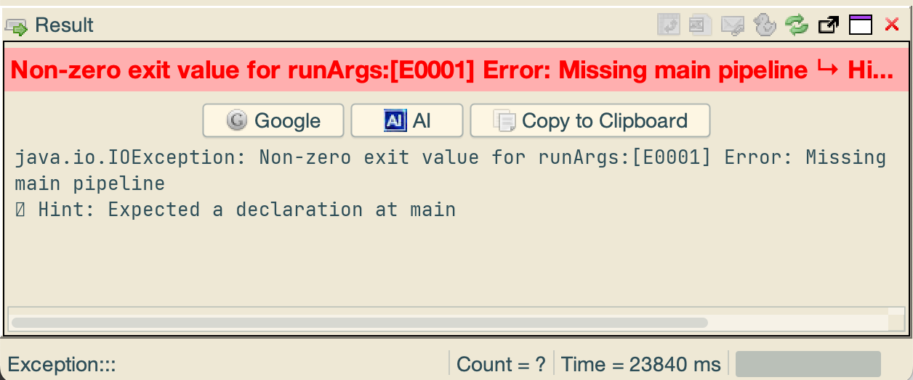
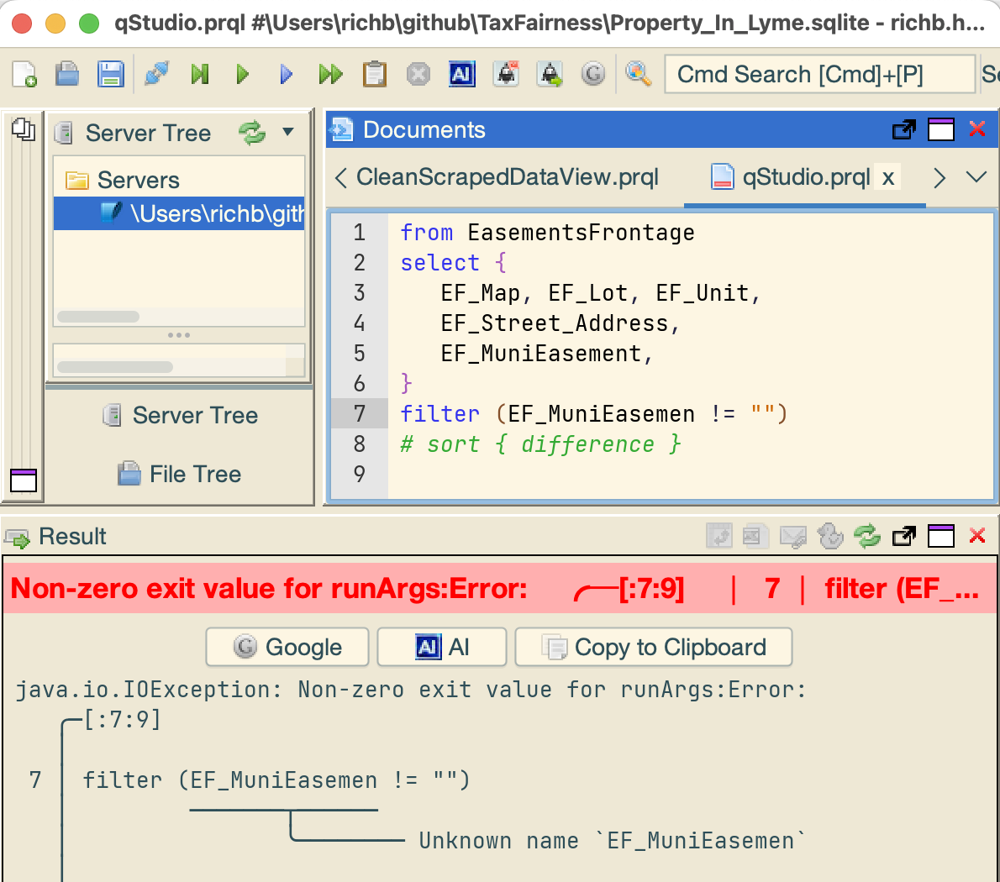
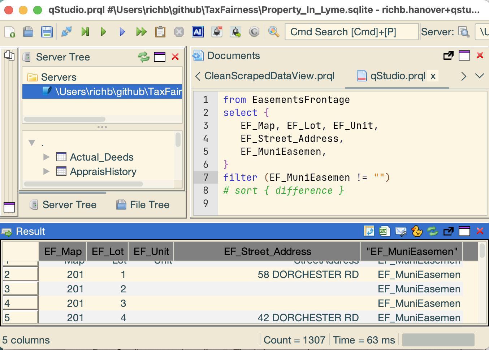

# qStudio/PRQL Lesson #3 - Practical Matters

You may encounter little problems with qStudio and PRQL.
Here's how to work around them.

## PRQL queries

PRQL is a terrific language for writing queries.
When the query is correct, it works great.

But its diagnostic messages are often arcane.
When things aren't correct, it displays the error
in a "red bar", and displays details below.
Here are some common error indications you'll encounter
and what to do about them:

### Missing main pipeline

The screen shot below shows `[E00001] Error: Missing main pipeline`
in the bottom half of the window.

This is most likely caused by trying to execute
an empty query or a commented-out line.
Click somewhere in the query window (to un-select) and re-execute. 

### Unknown name

PRQL is case-sensitive and cares about spelling.
The error message (in the image below)
`Unknown name 'EF_MuniEasemen'` shows that the
column name wasn't recognized because it was misspelled.
Similarly, if it had been typed in lower-case as `ef_munieasement`
it also would have given the "Unknown name" error.
To correct the error, simply fix the typo and re-execute.

### Unknown name (reason #2)

Correcting line 7 above (adding back the "t") but 
changing the query in line 5 (within the `select`)
to `EF_MuniEasemen` also gives an "Unknown name" error.
(Try it.) 

But qStudio still reports it on line 7.
The reason is a bit subtle:
the `select` transform passes along the named columns,
including one named `EF_MuniEasemen` (without the "t"). 
Yet the `filter` transform is looking a the column name
that has a "t", and so it gives the "Unknown name" error.
To correct the error, simply fix the typo and re-execute.

### Column heading in "..."

_Note:_ neither qStudio nor PRQL have any idea of the actual
column names in the database.
You must type them correctly in the query.
If a column name is consistently misspelled
(for example, both lines have `EF_MuniEasemen`),
qStudio will dutifully create and execute the query.

When the response returns, the database simply substitutes
the misspelling for the column name and the contents of the column.
In the screen shot below, notice:

* the column heading has its name in quotes (`"EF_MuniEasemen"`),
  an indication that there's no such column name in the table
* the column contains the string `EF_MuniEasemen` for all its rows.

To correct the error, simply fix the typo(s) and re-execute.

## Result window workarounds

The Result window displays table contents
and the results of a query.
Sometimes qStudio doesn't act quite as expected.

### Some columns are too wide in Result window

Drag the separator between columns to adjust their width.

### Result window doesn't always show a table

If you click a table name at the top left, the Result pane
(bottom of the window) shows the first 1,000 rows of that table.
When you execute a query, the Result pane shows the results
(as it should).

But if you then click a table name again,
the Result pane does not change.
To work around it, click a _different_ table name,
then the one you want.
The Result pane changes to the desired table.

### Result window only shows top 1,000 rows of a table.

When you click a table name,
the Result window shows the first 1000 rows.
There doesn't seem to be a way to see more rows,
or the next 1000 rows.
To work around this, execute the query `from <table-name>`:
then all rows appear.

### Result window doesn't pop out.

Sometimes, clicking the "pop-out" icon of the Result window
(black rectangle with arrow - see the screen shots above)
causes it to become a separate window.
Sometimes it doesn't. I don't know why.

